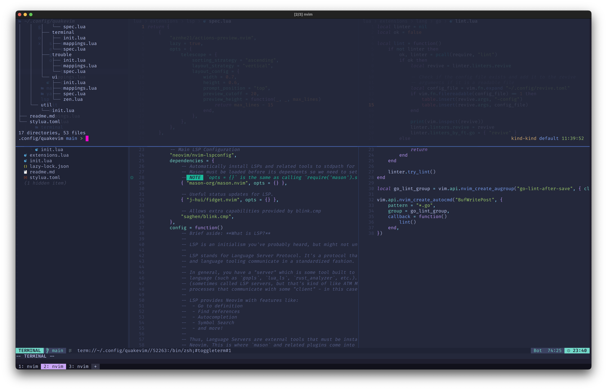

# Quakevim

This is quakevim, a neovim distribution taking some inspiration from Doom Emacs
with focus on being modular with a few core plugins and sane defaults.

    Doom laid the foundation, but Quake perfected the formula with pure,
    unadulterated speed. Where Doom plodded, Quake soared — a ballet of rockets
    and lightning guns performed at breakneck velocity. It’s not just a faster
    game; it’s a different dimension of movement altogether, where mastery of
    momentum separates the quick from the dead.

Obviously with drop down terminal:

And a floating one:

## Installation

Install using `git`:

    git clone --depth 1 https://github.com/mkrull/quakevim ~/.config/nvim/

Run:

    nvim

On first start [lazydev.nvim](https://github.com/folke/lazydev.nvim) will
install the core plugins and default extensions.

Run `:MakeConfig` to create a local config that is not managed from the checked
out repository. The command copies the default extensions file to
`$HOME/.quakevim.lua` and you can enable and disable extensions as needed using
`:EditConfig`.

## Core Plugins

The core plugins provide the core functionality other plugins and extensions
are able to rely on. The are enabled by default.
Quakevim makes heavy use
[telescope.nvim](https://github.com/nvim-telescope/telescope.nvim) for search,
file selection, and more generally it improves discoverability of many parts of
neovim, like help, highlights, registers, and more.

[which-key](https://github.com/folke/which-key.nvim) makes keymaps discoverable
and is used to add extension mappings.

Autocomplete is done using [blink.cmp](https://github.com/saghen/blink.cmp).

Autoformatting is done using [conform.nvim](https://github.com/stevearc/conform.nvim) unless configured otherwise for
example via lsp integration.

To enable easy changes to Quakevim itself as well as extension setup and
development [stylua-nvim](https://github.com/ckipp01/stylua-nvim) and
[lazydev.nvim](https://github.com/folke/lazydev.nvim) are set up by default.

## Extensions

Extensions are essentially plugins with somewhat standardized extra
configuration. Each extension has a `spec.lua` file that is used to install and
manage plugins via [lazy.nvim](https://github.com/folke/lazy.nvim).

They are enabled and disabled in the neovim config dir's top level
`extensions.lua`.

`:MakeExtension lang/gleam` will create a new directory containing a
`spec.lua`, an `init.lua`, and a `mappings.lua`. The extension gets
automatically installed and required at startup once it is listed in the top
level `extensions.lua` file.
